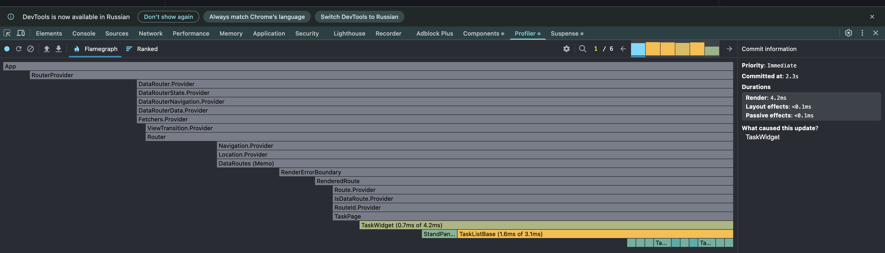
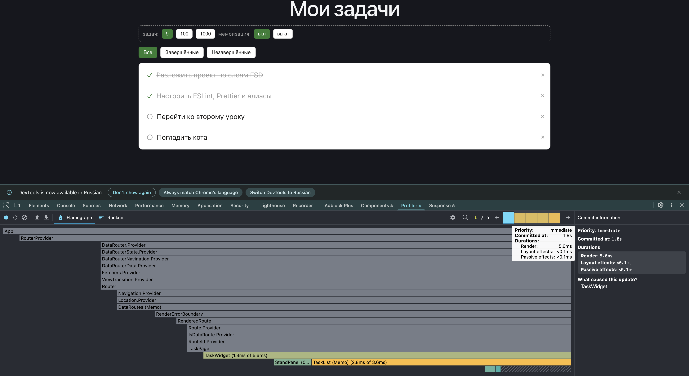
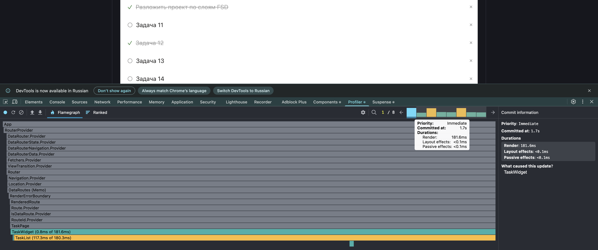
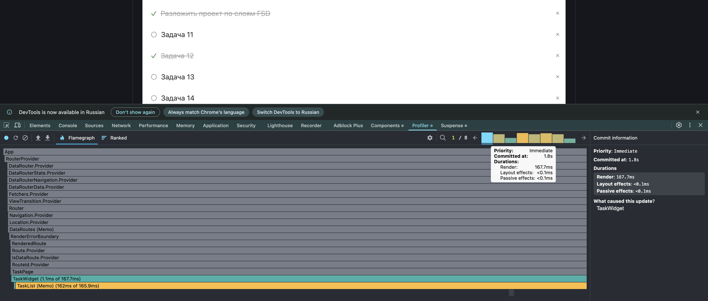

# LESSON-2 — Оптимизация производительности

Ветка: `lesson-2`

## Запуск

```bash
npm ci
npm run dev     # http://localhost:5173
npm run build
npm run lint
```

## Что сделал

Обернул `TaskCard` в `React.memo`, фильтрацию в `useTasks` перевёл на `useMemo`
(зависимости `[allTasks, filter]`), `removeTask` — на `useCallback` с пустыми
зависимостями (функциональная форма `setAllTasks(prev => …)`, замыкание не держит
старый список). Заодно обернул в `memo` и `TaskList` — иначе стабильные `tasks`
и `removeTask` сравнивать было бы некому, и толку от них ноль.

## Профилирование

Запустил React DevTools → Profiler, снял профиль на удалении одной задачи — сначала
просто так, на девяти задачах, как в проекте.





На девяти задачах разницы толком не видно — коммит что без мемоизации, что с ней занимает
пару миллисекунд, и на глаз непонятно, сработала она вообще или нет. Единственное, что
отличается, — сам flamegraph: без мемоизации ряд карточек внизу закрашен (React прогнал
каждую), с мемоизацией — серый, заштрихованный (не трогал вообще). То есть memo работает, но на таком объеме данных было не понятны различия скорости.

Чтобы увидеть разницу ещё и по времени, а не только по цвету клеток, поднял список до
тысячи задач (на время замера) и повторил то же самое:





181.6 мс без мемоизации против 167.7 с ней. В итоге разница тоже не особо большая —
хотя карточки с мемоизацией и правда не перерисовываются (это опять видно по серому ряду
внизу), общее время почти не меняется. Посмотрел, куда уходит время:
162 мс из 167.7 — это сам `TaskList`, а не карточки. То есть memo честно убирает работу
внутри карточек, но React всё равно должен пересобрать список `tasks.map(...)` и сверить
его со старым — а это уже работа не карточки, а списка, и memo на неё не влияет.

## Наблюдения

1. По flamegraph сразу понятно, что memo работает: без него карточки внизу закрашены
   (все вызваны), с ним — серые. На девяти задачах — 14 вызовов `TaskCard` против 0.
   Карточке передаётся только `task`, а при фильтрации объекты задач не пересоздаются,
   меняется только массив — поэтому ссылка та же и сравнение проходит.

2. А вот что по времени выигрыш такой маленький — для меня было неожиданностью, пока
   не посмотрел, куда уходят миллисекунды. 98% времени коммита — внутри `TaskList`,
   а не в карточках. React всё равно пересобирает список и сверяет его со старым,
   и это работа списка целиком, а не отдельной карточки — memo её не убирает.

3. Получается, memo окупается, когда сам компонент тяжёлый, а не когда список длинный.
   У нас карточка — `div` и два `span`, экономить там особо не на чем. Для длинных
   списков правильный инструмент — виртуализация, рендерить только то, что видно
   на экране.

4. Ещё заметил: `useMemo` и `useCallback` без `memo` на потребителе — просто лишний
   код. Пока `TaskList` не был обёрнут в `memo`, стабильные ссылки на массив и функцию
   были никому не нужны сравнивать их всё равно было некому.

5. memo не спасает от монтирования. Когда фильтр добавляет на экран новые
   карточки, это не повторный рендер, а создание новых узлов, и `React.memo` тут
   ни при чём.

## Не сделано / вопросы

- нет
